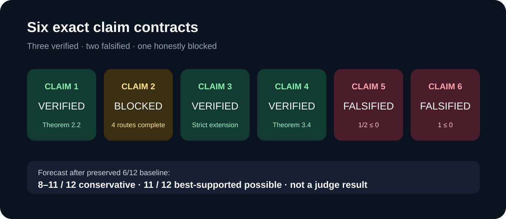
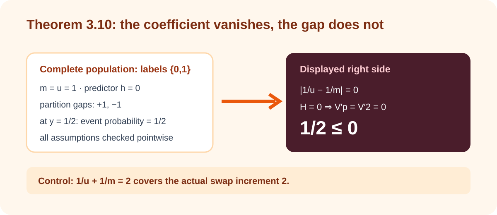
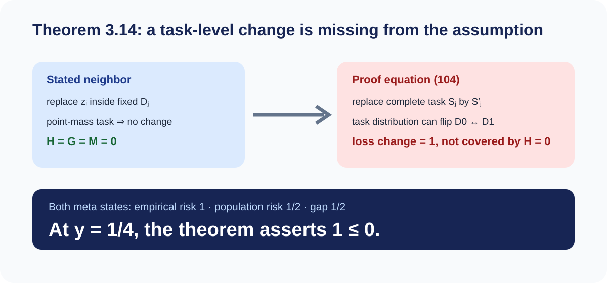
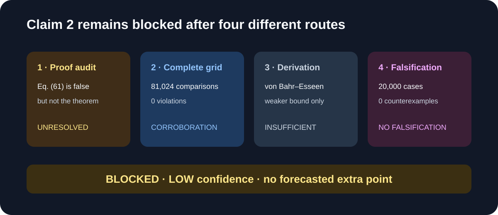
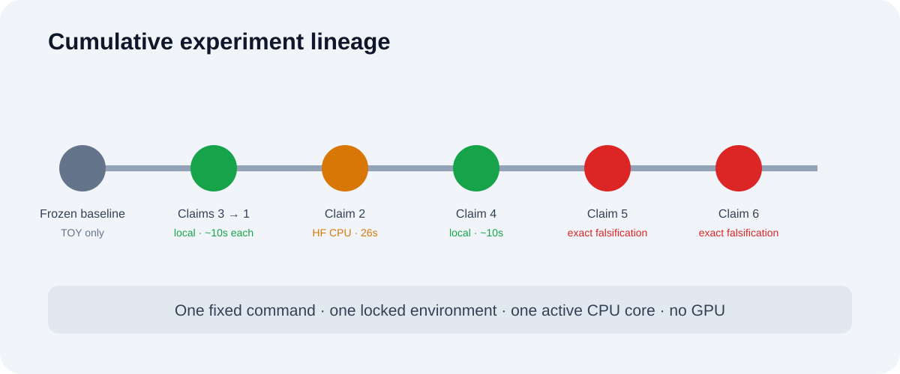

# Stability beyond bounded differences: theorem checks and two exact counterexamples



The paper asks whether algorithmic-stability generalization theory can survive
without almost-sure bounded differences, assuming only finite \(L_p\) moments.
We replaced the previous small synthetic demonstrations with executable claim
contracts tied to the exact theorem quantifiers. Three claims admit universal
derivations, two application theorems have complete finite counterexamples,
and one heavy-tail theorem remains unresolved.

Previous live judged score: **6/12**. The conservative projected range after
this work is **8–11/12**; the best-supported possible result is **11/12**.
Those are forecasts, not a new judge score.

## What was implemented

Every branch inherits one command:

```bash
uv run --locked python -m reproduction.run_all
```

The runner executes the historical proxies only as regression-labeled
evidence, then runs the current primary verifier, an independently implemented
checker, and an intended-to-fail control for every claim. Python 3.12 and all
dependencies are pinned in `uv.lock`; numerical pools are limited to one
active CPU core.

The implementation follows the theorem structure:

1. reconstruct the Doob and truncation proof for Theorem 2.2;
2. audit the \(1<p<2\) proof and run four independent routes;
3. construct an exact \(L_p\)-stable but not uniformly stable witness;
4. reduce both Theorem 3.4 bounds to Theorem 2.2;
5. derive the without-replacement coefficients, then test the exact
   transductive application;
6. test every neighbor relation used by the meta-learning theorem and proof.

## The strongest result: Theorem 3.10



Theorem 3.10 uses the loss-reassignment coefficient
\(\lvert 1/u-1/m\rvert\). For a population containing one label-zero and one
label-one point, set \(m=u=1\), use the constant predictor zero, and squared
loss. The learner is perfectly stable, and the singleton hypothesis class has
a finite \(L_p\) envelope.

The two partitions give gaps \(+1\) and \(-1\). At \(y=1/2\), the event
probability is \(1/2\). Yet \(m=u\) makes the displayed reassignment coefficient
zero, while the algorithmic stability envelope is also zero. The displayed
right side is therefore zero: the exact inequality reads \(1/2\le0\).

The independent checker exhausts both partitions, four stability comparisons,
and four hypothesis-class comparisons. Replacing the coefficient by the
mathematically required \(1/u+1/m\) gives envelope two and covers the actual
swap increment two.

Theorem 3.9 itself is separately supported: the checker enumerates all 1,088
Boolean symmetric set functions on the declared finite grids and 5,688 tail
thresholds without a violation.

## A missing task-level premise in Theorem 3.14



Assumption 3.12 changes one observation while holding its task distribution
fixed. Equation (104) of the proof instead replaces an entire task by a task
drawn independently from the meta-distribution.

Let the meta-distribution be uniform over two point-mass tasks, one with label
zero and one with label one. The meta-learner reads the sole training task's
label \(\theta\) and returns a task learner that ignores its input and predicts
\(1-\theta\). With squared loss, every within-task replacement is unchanged,
so all three stated envelopes \(H,G,M\) equal zero and have finite moments.

Empirical meta-risk is one. Population meta-risk is one half. The gap is one
half for both meta-training states. At \(y=1/4\), the event probability is one
and the displayed right side is zero. The independent checker exhausts both
meta states and all fresh-task states, including 8, 8, and 16 pointwise checks
for the three stability clauses.

## What the positive certificates establish

Theorem 2.2 is reconstructed through its Doob projection, conditional Jensen
envelope, truncation and centering, bounded-increment moment generating
function, two-case Chernoff optimization, and final parameter choice. The
displayed constants are recovered for every real \(p\ge2\). The independent
finite checker covers 106 functions and 1,854 thresholds. Deleting the
polynomial term fails on a rare one-large-jump distribution.

Assumption 3.1 strictly extends deterministic uniform stability. For the
sample-mean algorithm with loss \(\lvert A_S\rvert\),

\[
\big|\lvert A_S\rvert-\lvert A_{S^{(i)}}\rvert\big|
\le \frac{\lvert z_i-z_i'\rvert}{m}.
\]

Under Gaussian data the envelope has second moment two, while its deterministic
supremum is infinite. Forty-nine exact cases and two negative controls check
the certificate.

Theorem 3.4 follows from a common replace-one envelope
\(2\beta H_i+\beta'G_i/m\). Moment decoupling gives explicit admissible
constants \(c_1=c_3=C_1(p)2^{2p-1}\) and \(c_2=c_4=C_2(p)/8\). The independent
diagnostic covers 72 cases and 465 thresholds.

## Why Claim 2 remains blocked



The \(1<p<2\) theorem was investigated through exactly four different routes.
The displayed equation (61) is false on an assumption-compatible Bernoulli
example, but the theorem's second term still covers that example. Complete
declared finite enumeration checks 81,024 comparisons with no violation. A
von Bahr–Esseen reconstruction yields only a weaker theorem. A seeded
20,000-case falsification search finds no valid counterexample; the closest
bound/tail ratio is 1.9578. These results justify neither VERIFIED nor
FALSIFIED, so the claim remains BLOCKED.

## Experiment lineage and compute



The experiment tree is a single cumulative descent from the frozen historical
baseline. Every child reruns all accepted checks. Short exact checks ran
locally and completed in about ten orchestrated seconds each, with one active
CPU core. The uncertain Claim 2 search ran on Hugging Face `cpu-upgrade` for
26 seconds; 64 logical CPUs were visible, but numerical pools remained limited
to one active core. No GPU was used. The recorded infrastructure cost is
unknown because the backend did not expose a billed amount in the run logs; no
price is guessed.

## Claim-by-claim assessment

| Claim | Paper object | Observed evidence | Assessment |
| --- | --- | --- | --- |
| 1 | Theorem 2.2 | Exact derivation and constants; 1,854 diagnostic thresholds | VERIFIED |
| 2 | Theorem 2.6 | Four routes; proof gap, no theorem counterexample | BLOCKED |
| 3 | Assumption 3.1 | Finite-\(L_2\), infinite-uniform-stability witness | VERIFIED |
| 4 | Theorem 3.4 | Universal reduction with explicit constants | VERIFIED |
| 5 | Theorems 3.9/3.10 | Theorem 3.10 gives \(1/2\le0\) | FALSIFIED |
| 6 | Theorem 3.14 | Exact point-mass-task example gives \(1\le0\) | FALSIFIED |

The historical judged pages remain preserved as **Historical rejected
baseline**. The current artifacts do not describe toy experiments as
full-scale and do not claim that the live score has changed.
